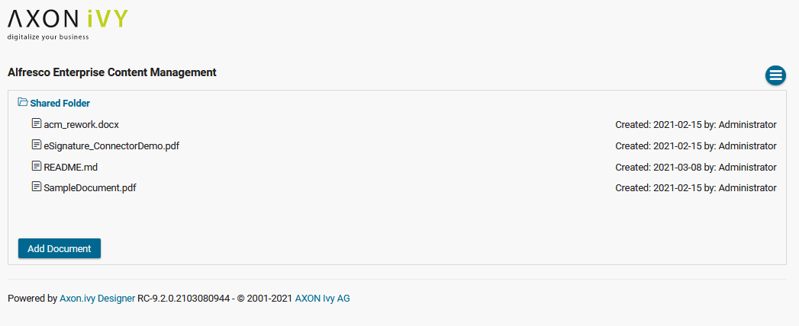
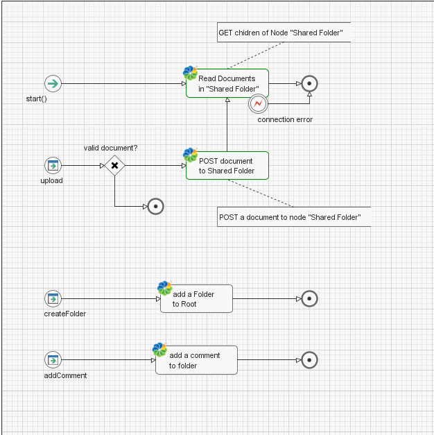
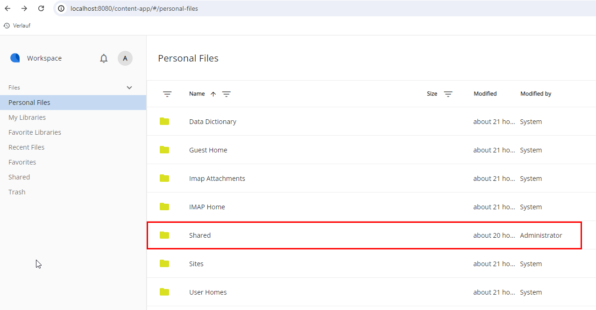
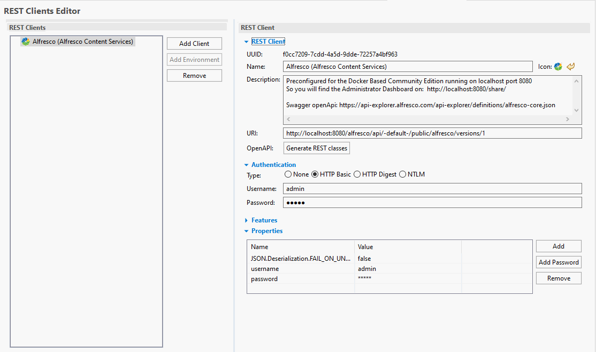

# Alfreso Plattform ECM Konnektor

Der [Alfresco Plattform ECM](https://www.alfresco.com/de/ecm-software)-Konnektor
von Axon Ivy Dir dabei auf Unternehmensinhalte zugreifen können, die in einem
Alfresco-ECM abgelegt sind. Die Alfresco Plattform umfasst alle Funktionen eines
Enterprise-Content-Management-Systems (ECM).

Dieser Konnektor:

- Basiert auf REST-Webservice-Technologien.
- Bietet Zugriff auf die Kernfunktionen der Alfresco-Plattform, z. B. das
  Erstellen von Ordnern oder das Speichern von Dokumenten.
- Bietet eine Demo Implementierung.

## Demo

Zeigt, wie man Ordner erstellt und Dokumente speichert.

Wenn Du die Docker-Installation wie in Kapitel
[Setup](https://market.axonivy.com/alfrescoecm#tab-setup) beschrieben, verwendet
haben, kannst Du den Daten Upload mit
http://localhost:8080/content-app/#/personal-files testen – die Datei sollte im
Ordner „shared” abgelegt werden:

## Setup

Der Konnektor ist für die Community Edition für Docker vorkonfiguriert, die auf
dem lokalen Host unter Port 8080 läuft, siehe:
https://docs.alfresco.com/content-services/community/install/containers/docker-compose/.
Du kannst den Alfresco Rest Client anpassen, um auf Deine Alfresco-Installation
zuzugreifen.

